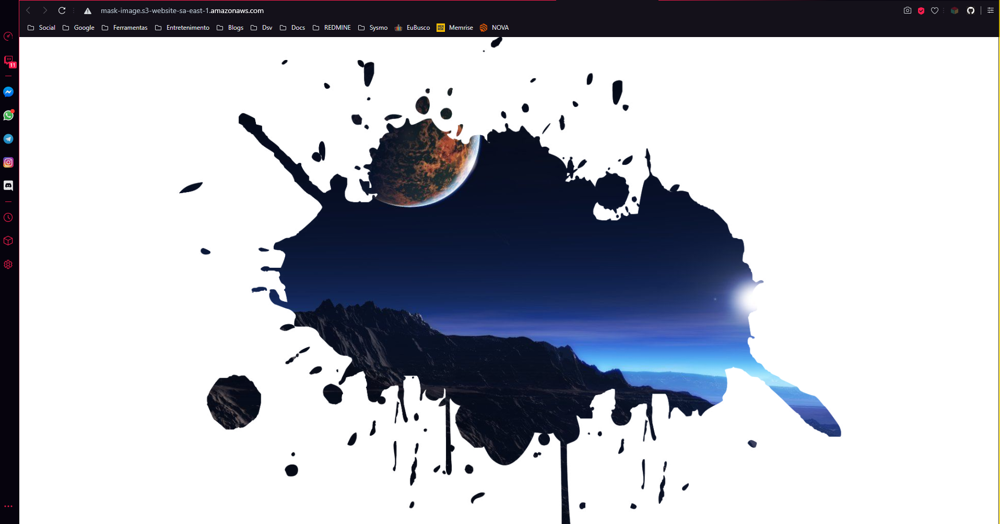

# 💻 Image Mask

📱 Projeto desenvolvido com o objetivo de aprimorar os conhecimentos com HTML + CSS e animações.
 
🏷️ O projeto foi desenvolvido baseando-se no seguinte [vídeo](https://youtu.be/lBK_kh4iCAQ?list=PLGcCUWE4uaqUZF203MRZldNi-9Afi5SrO).

---

Demonstração do app:

---

🧪 Para testar o site basta acessar o seguinte [link](http://mask-image.s3-website-sa-east-1.amazonaws.com).

 

🙏 Qualquer sugestão e melhoria é muito bem vinda!